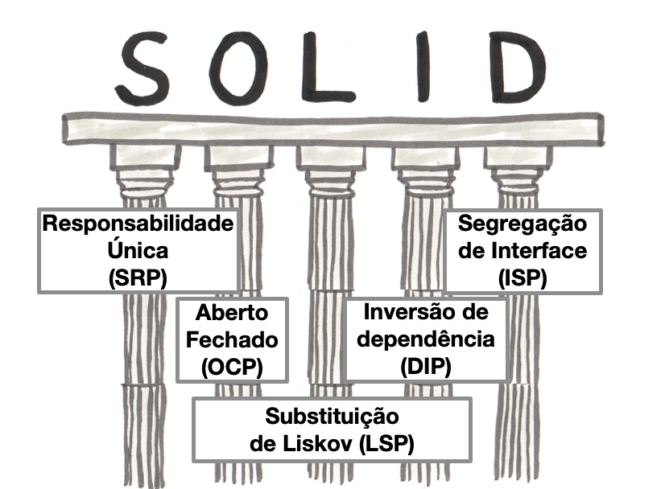

# Introdução SOLID

    

 
Nesse resumo sobre princípio SOLID, estarei escrevendo baseado as diversas referências que me fizeram chegar ao entendimento dos principios e como aplicar principalmente no laravel.

 

---

As vezes as bases de códigos são tão complexas, simplesmente porque as pessoas que escreveram a primeira versão estavam com pressa, e as que vieram depois continuaram aumentando a bagunça. O resultado final: uma bagunça que poucos querem tocar e ninguém entende.

Escrever um bom código, um código modular e fácil de manter, não é tão difícil. Apenas cinco princípios simples estabelecidos há muito tempo e bem conhecidos se seguidos com disciplina, garantirão que seu código seja legível, para outras pessoas e para você quando você olhar para ele seis meses depois. Abaixo segue os cincos princípios do SOLID. 

 

* A letra “S” se refere a Single Responsibility Principle (Princípio da Responsabilidade Única)
* A letra “O” diz respeito a Open-Closed Principle (Princípio de Aberto-Fechado)
* A letra “L” corresponde ao termo Liskov Substitution Principle (Princípio da Substituição de Liskov)
* A letra “I” remete ao termo Interface Segregation Principle (Princípio da Segregação de Interface)
* A letra “D” é referente a Dependency Inversion Principle (Princípio da Inversão de Dependência)

